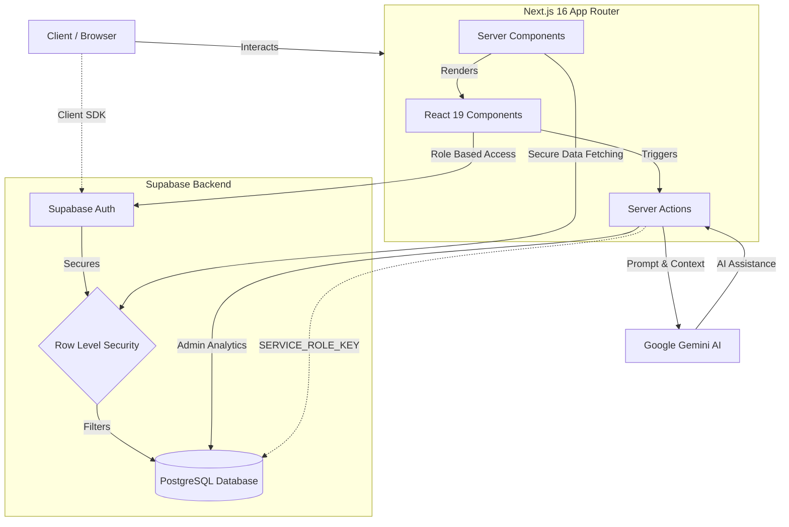

# ORBYT - The Intelligent Campus OS

## The Problem

Educational institutions struggle with fragmentation. Core operations run on dozens of disconnected systems—from attendance and fee portals to hostel management, placement trackers, and scattered communication channels like emails and WhatsApp groups. 

Simultaneously, campuses require strict safety measures, including emergency communication, women's safety protocols, incident reporting, and visitor management. Currently, these safety and operational layers are isolated from one another, leading to delayed emergency responses, inaccessible administrative information, and a poor experience for students, faculty, and administrators.

## Proposed Solution

**ORBYT** is a unified, AI-powered Smart College ERP & Campus Safety Platform. It replaces disjointed portals with a single intelligence layer that brings academics, campus services, and institutional safety into a unified operating system.

Instead of navigating multiple systems, students and staff can manage their campus life from one centralized platform:
- **Unified Academic & Operational Dashboards:** Centralized role-based portals for students, employees, and administrators to manage attendance, timetables, exams, fees, and clubs.
- **Integrated Campus Safety Layer:** Real-time incident reporting, SOS alerts, and emergency response workflows directly connected to campus administration and security.
- **AI-Powered Discovery & Assistance:** A context-aware intelligence layer that parses official institutional handbooks, matches students to relevant opportunities, and provides instant answers backed by official citations.

## Tech Stack

- **Framework:** [Next.js 16](https://nextjs.org/) (App Router, Server Components)
- **Frontend:** React 19, [Tailwind CSS v4](https://tailwindcss.com/), [Framer Motion](https://www.framer.com/motion/) (Animations)
- **Database & Auth:** [Supabase](https://supabase.com/) (PostgreSQL, Row Level Security, Authentication)
- **State Management:** Zustand
- **AI Integration:** Google Generative AI (Gemini)

## System Architecture

ORBYT leverages a modern, server-first architecture tailored for security and speed:

## Team: Black Squad

- **Prodhosh V S** - Lead
  - Software Engineer Intern at Annexra
  - Ex-intern at Sindra and Enlighted (Developer)
  - CTO of BSPrep - IITM BS Community
- **Mohamed Nawaz**
